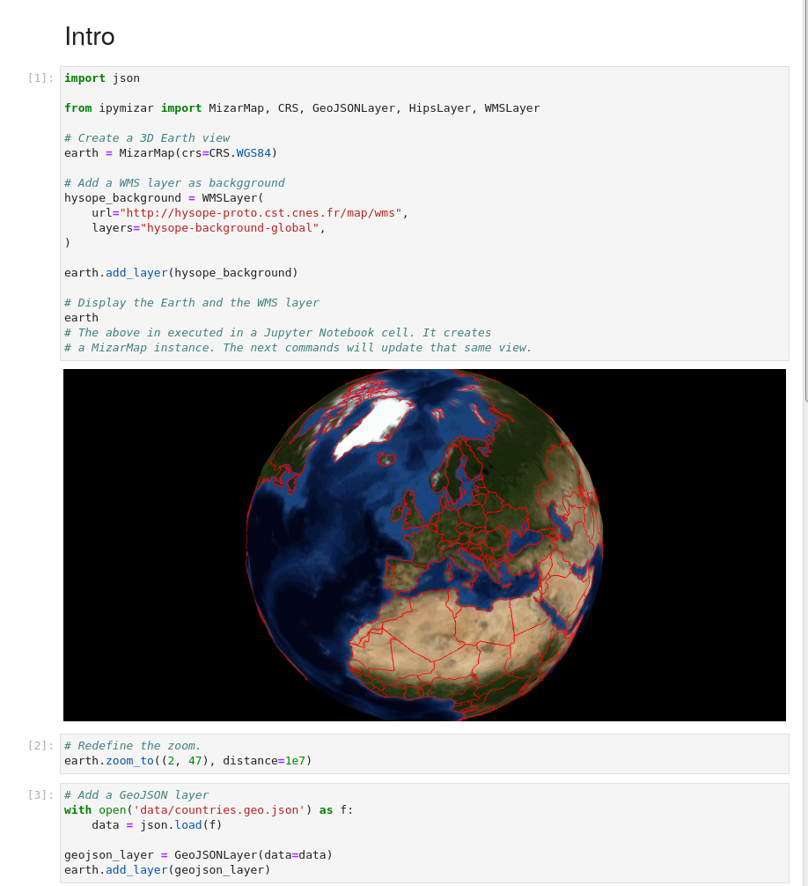
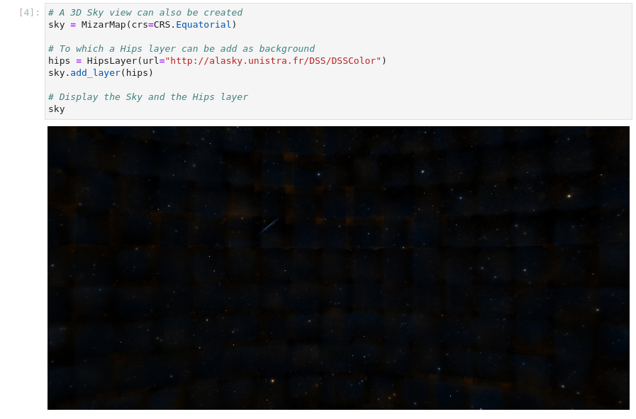

# ipymizar

A Jupyter / Mizar plugin to display interactive 3D views of planets and the sky in a notebook.

## Python API

### Create a Planet Map and update it

### Create a Sky Map and update it

## Installation

To install use pip:

    $ pip install ipymizar

## Dev installation

Clone the repo:

    $ git clone LINKTOGIT
    $ cd ipymizar

For a development installation, you can use `conda` to create a dev environment with the required dependencies (including [Node.js](https://nodejs.org) and [Yarn version 1](https://classic.yarnpkg.com/)):

    $ conda env create --file dev-environment.yml
    $ conda activate ipymizar-dev

Install a dev version of `ipymizar`:

    $ pip install -e .

When developing for the classic Jupyter Notebook (launched with `jupyter notebook`), run:

    $ jupyter nbextension install --py --symlink --overwrite --sys-prefix ipymizar
    $ jupyter nbextension enable --py --sys-prefix ipymizar

When developing for JupyterLab (launched with `jupyter lab`), run the following command only if using JupyterLab <= 2:

    $ jupyter labextension install @jupyter-widgets/jupyterlab-manager ipymizar

This command has to be run whatever the version of JupyterLab (not required for the classic version):

    $ jupyter labextension develop --overwrite .

Then you need to rebuild the front-end (Javascript) when you make a code change:

    $ cd js
    $ yarn build

If you change the code:

* In Python: the kernel needs to be restarted using the Kernel menu item available on the Web UI
* In Javascript: rebuild and refresh the notebook page

To build/rebuild the front-end:

    $ cd js

And the following command to build both the notebook and the lab extensions;

    $ yarn build

Or one of these commands to build one of these extensions in watch mode (automatically rebuilds when a change is detected):

    $ yarn watch:nbextension

or

    $ yarn watch:labextension
